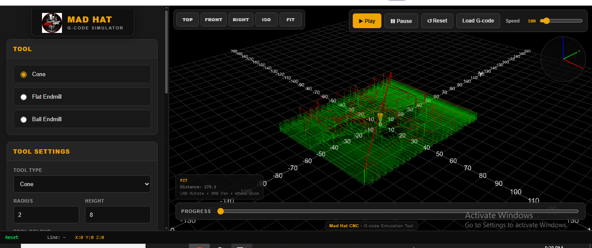

This is an experimental Gcode simulator written mostly with Chat GPT 5.1
IMPORTANT DISCLAIMER: This is my personal project and has only been tested by me.
 If you choose to run it, you do so entirely at your own risk. 
I am not responsible for any damage, malfunction, or personal injury that may result from the use or misuse of this software.
 Use it with caution and at your own discretion.

Runs in your browser so no dependencies needed, just an internet connection

3 Axis Gcode Simulator

